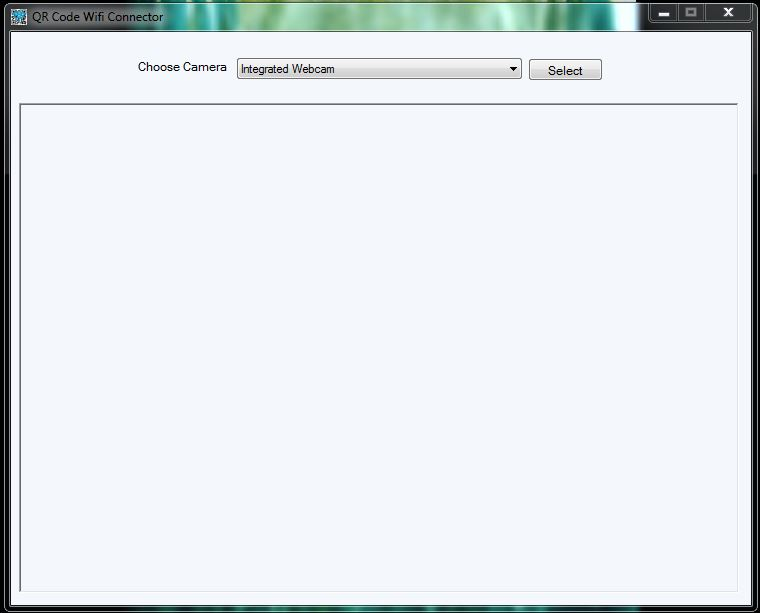
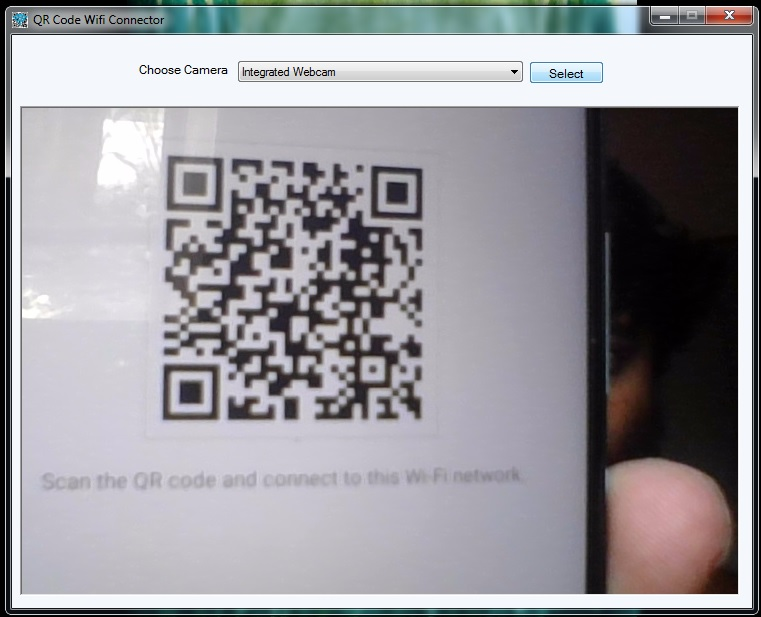
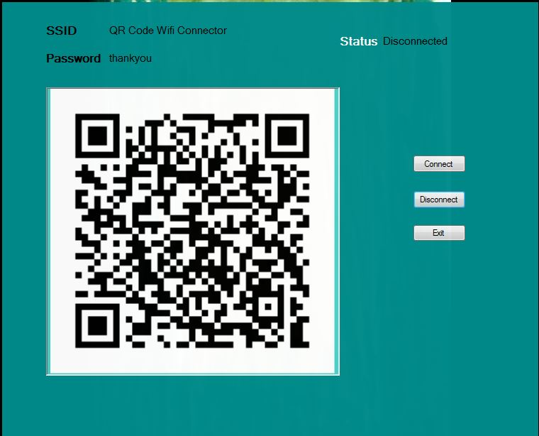

# QR-Code-Wifi-Connector

A simple **PC software** to connect to WiFi networks using QR codes on **Windows (7, 8, 10, 11)**.  
It allows users to scan a QR code and automatically connect to the network without typing passwords manually.

Download Link: [QR-Code-Wifi-Connector](https://astabol.github.io/QR-Code-Wifi-Connector/))

---

## 🧭 Table of Contents

- [Features](#features)
- [How It Works](#how-it-works)
- [Setup & Usage](#setup--usage)
- [Folder Structure](#folder-structure)
- [Screenshots](#screenshots)
- [Contributing](#contributing)
- [License](#license)

---

## 🚀 Features

- Connect to WiFi SSID using QR Code  
- Works on all modern Windows versions (7, 8, 10, 11)  
- 100% local execution — no internet or server required  
- Lightweight, fast, and portable (no installation needed)  
- GUI-based interface for easy use  

---

## ⚙️ How It Works

1. The application uses your **PC webcam** to scan a WiFi QR Code.  
2. It decodes the SSID and password from the QR Code.  
3. Automatically configures and connects the PC to the WiFi network using system WiFi APIs.  

Example QR Format (standard WiFi QR format):  
```
WIFI:T:WPA;S:MyNetwork;P:MyPassword;;
```

---

## 💻 Setup & Usage

1. Clone the repository:  
   ```bash
   git clone https://github.com/Astabol/QR-Code-Wifi-Connector.git
   cd QR-Code-Wifi-Connector
   ```

2. Build or run the project:  
   - Open the project in your preferred IDE (e.g., Visual Studio / Code::Blocks).  
   - Compile the source code or run the executable directly (if provided).  

3. Run the executable:  
   - Launch the app.  
   - Allow camera access when prompted.  
   - Scan a WiFi QR Code and connect instantly.

---

## 📁 Folder Structure

```
QR-Code-Wifi-Connector/
├── src/                # Source code
├── assets/             # Icons, QR code samples
├── build/              # Compiled binaries
├── README.md           # Project documentation
└── LICENSE             # License file
```

---

## 🖼 Screenshots

| Home Page | Scanning QR Code | Connected Successfully |
|------------|------------------|------------------------|
|  |  |  |


---

## 🤝 Contributing

Contributions are welcome!  
If you find a bug or want to add a new feature:

1. Fork this repository  
2. Create your branch (`git checkout -b feature-name`)  
3. Commit your changes (`git commit -m "Added feature XYZ"`)  
4. Push to your branch (`git push origin feature-name`)  
5. Create a Pull Request  

---

## 🪪 License

This project is licensed under the [MIT License](LICENSE).  
Feel free to use and modify it for personal or commercial projects.

---

**Author:** [Astabol](https://github.com/Astabol)  
📧 Contact: Available on GitHub Profile

